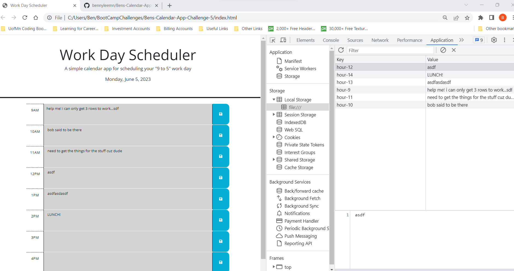

# Bens-Calendar-App-Challenge-5
Description: Create a simple web calendar appliction to make notes in blocks of time between 9 am and 5 pm local (machine) time.
Each entry into a time block is saved in local storage and displayed to user on the webpage.
When the hour is in the past, it is grey.
When the hour is the current hour, it is red.
When the hour is in the future, it is blue.

Link to deployed site: check it out --> [(https://bennyleemn.github.io/Bens-Calendar-App-Challenge-5/)]

Link to repo: [https://github.com/bennyleemn/Bens-Calendar-App-Challenge-5]

Screenshot  

Contributors: Slack or Discord Study Groups - TA (Akon), internet (stackoverflow), coursework for week.

Motivation: To continue learning to code using html, css, js, jquery and api's.

Why did you build this project: To get better acquainted with api usage and jquery. I also used console log a bit more than i had been. 